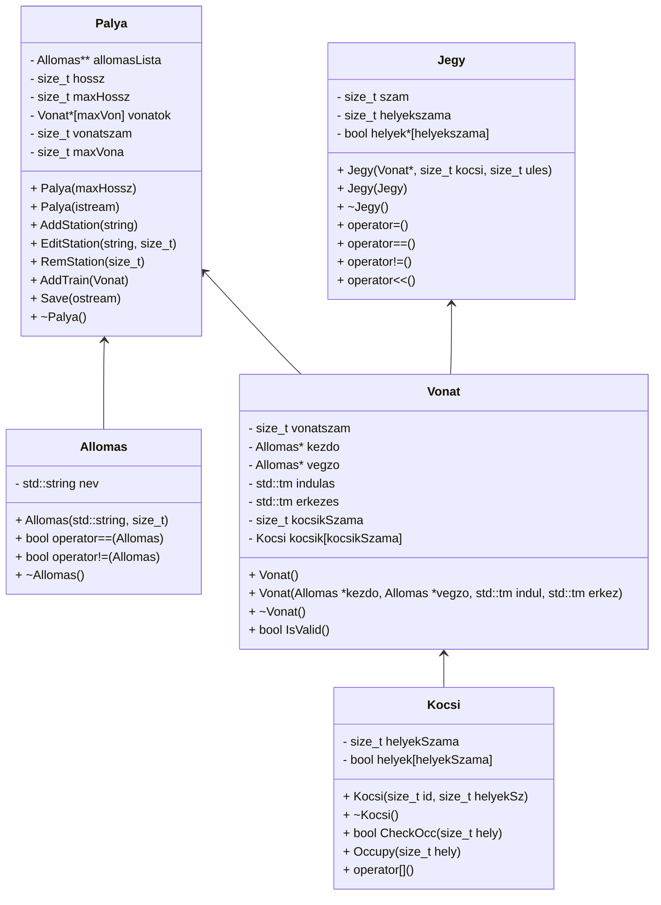

# Nagy házi feladat dokumentáció
## Feladat

Tervezze meg egy vonatjegy eladó rendszer egyszerűsített objektummodelljét, majd valósítsa azt meg! A vonatjegy a feladatban mindig jegyet és helyjegyet jelent együtt. Így egy jegyen minimum a következőket kell feltüntetni:

- vonatszám, kocsiszám, hely
- indulási állomás, indulási idő
- érkezési állomás, érkezési idő

A rendszerrel minimum a következő műveleteket kívánjuk elvégezni:

- vonatok felvétele
- jegy kiadása

A rendszer később lehet bővebb funkcionalitású (pl. késések kezelése, vonat törlése, menetrend, stb.), ezért nagyon fontos, hogy jól határozza meg az objektumokat és azok felelősségét.
Valósítsa meg a jeggyel végezhető összes értelmes műveletet operátor átdefiniálással (overload), de nem kell ragaszkodni az összes operátor átdefiniálásához! A megoldáshoz **ne** használjon STL tárolót!

## Osztálydiagram

## Megvalósítás

## TODO 

- [ ] `README.MD`
  - [x] class diagram
  - [ ] megvalósítás
  - [ ] osztályok leírása
  - [ ] TODO lista befejezése
  - [ ] lisence
- [ ] `vonat.cpp`
  - [x] Kocsi
  - [ ] Vonat
- [ ] `jegy.cpp`
- [ ] `allomas.cpp`
- [ ] `palya.cpp`
  - [ ] Mentés
  - [ ] Betöltés / létrehozás
- [x] `vonat.hpp`
- [x] `jegy.hpp`
- [x] `allomas.hpp`
- [x] `palya.hpp`
- [ ] `main.cpp`
  - Tesztek
    - [ ] Mentés
    - [ ] Jegykiadás 